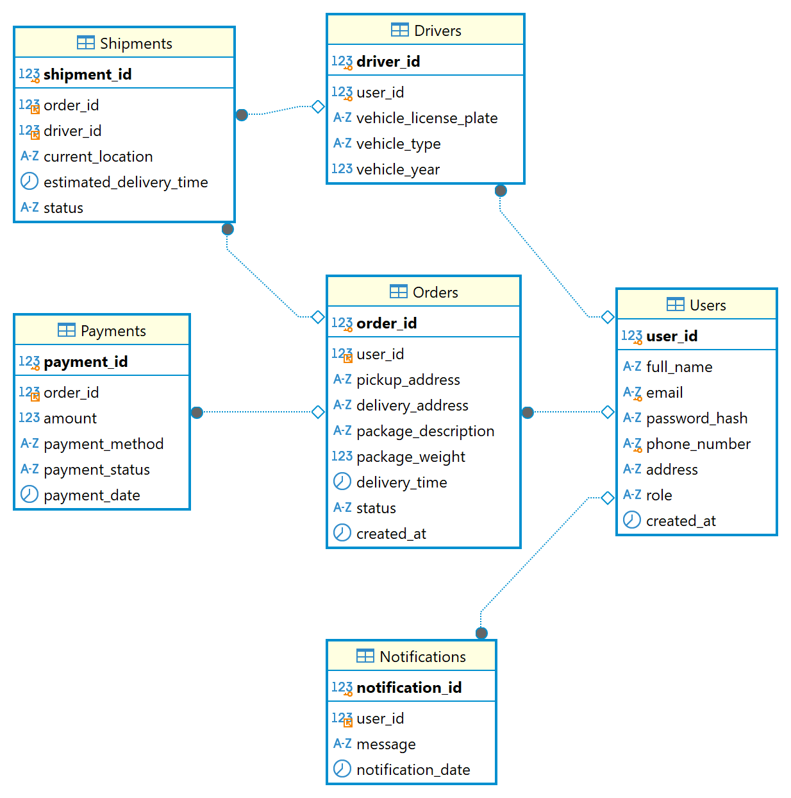
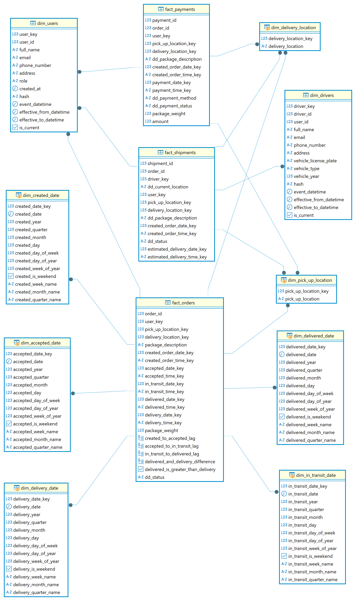

# 📄 Logistics Data Warehouse

## 📖 Giới thiệu

Dụ án xây dựng 1 luồng etl và 1 luồng elt toàn diện nhằm trích xuất, biến đổi và lưu trữ dữ liệu phục vụ cho phân tích và báo cáo. Đặc biệt, dự án triển khai ETL theo **hai hướng độc lập** từ cùng một nguồn dữ liệu MySQL  và sử dụng cùng một schema của Data Warehouse:
- **ETL bằng Apache Spark**: Sử dụng HDFS 3 Sink Connector để trích xuất dữ liệu từ Kafka và sau đó sử dụng spark để xử lý qua mỗi lớp (Raw → Enriched → Curated), lưu dưới dạng Avro, Parquet và Delta Table.
- **ELT bằng DBT**: Sử dụng ClickHouse Sink Connector để trích xuất dữ liệu từ Kafka và lưu trực tiếp vào ClickHouse, sau đó Sử dụng dbt để biến đổi và xây dựng các model (dimension, fact, staging) dựa trên dữ liệu trong ClickHouse, tạo ra Data Warehouse.

## 🔍 MySQL & Data Warehouse

### 1. MySQL
- Đây là nguồn dữ liệu gốc của hệ thống, chứa các bảng như: **Users**, **Drivers**, **Orders**, **Shipments**, **Payments**, **Notifications**.
- Dữ liệu từ MySQL được trích xuất thông qua Kafka Connect (sử dụng Debezium MySQL Connector) và trích xuất vào kafka broker.

### 2. Data Warehouse
- Đây là schema của Data Warehouse, được xây dựng dựa trên dữ liệu đã được transform và tích hợp từ nguồn.
- Bao gồm các bảng dimension và fact (theo mô hình Kimball) được lưu trữ trong hệ thống lưu trữ phân tích (ClickHouse hoặc Delta Table thông qua Spark).

## 🔄 Kiến trúc dự án

### Trích xuất & xử lý
- **Nguồn dữ liệu**: MySQL
- **ETL bằng Spark**:
  - **Raw Layer**: Dữ liệu được trích xuất từ Kafka bằng HDFS Sink Connector dưới dạng Avro, phân vùng theo ngày/tháng/năm.
  - **Enriched Layer**: Sử dụng Apache Spark để lọc, làm sạch và chuyển đổi dữ liệu, lưu dưới dạng Parquet, phân vùng theo ngày/tháng/năm.
  - **Curated Layer**: Spark tiếp tục xử lý để xây dựng Data Warehouse, lưu dưới dạng Delta Table.
- **ELT bằng dbt**:
  - Sử dụng dbt để thực hiện transform dữ liệu từ các bảng nguồn, áp dụng các kỹ thuật như Slowly Changing Dimension Type 2 (SCD Type 2) và Incremental Append, nhằm xây dựng các bảng dimension và fact trong Data Warehouse trong clickhouse.

### Orchestration
- **Apache Airflow**: Điều phối toàn bộ quy trình ETL, bao gồm việc chạy các job Spark và các lệnh dbt theo lịch trình.

## 📂 Cấu trúc dự án

### 1. Airflow
- **Dockerfile**: Image Apache Airflow mở rộng cài Spark, Java và các thư viện bổ sung.
- **dags/**: Chứa các DAG điều phối công việc:
  - `spark_logistics_dag`: DAG cho các Spark Application (ETL bằng Spark).
  - `dbt_logistics_dag`: DAG điều phối các lệnh dbt.
- **requirements.txt**: Danh sách các thư viện Python cần thiết.

### 2. ClickHouse
- **clickhouse-creating-tables/**: Các file SQL tạo bảng trong ClickHouse để hứng dữ liệu từ ClickHouse Sink Connector.
- **creating-views/**: Các file SQL tạo view cho các bảng dimension (`dim_date`, `dim_locations`) phục vụ báo cáo như là Power BI.

### 3. ETL theo Spark
- **Raw Layer**: trích xuất dữ liệu từ Kafka vào HDFS bằng HDFS Sink Connector (Avro, phân vùng theo thời gian).
- **Enriched Layer**: Sử dụng Spark để làm sạch và chuyển đổi dữ liệu, lưu dưới dạng Parquet.
- **Curated Layer**: Sử dụng Spark để tích hợp dữ liệu thành Data Warehouse, lưu dưới dạng Delta Table.

### 4. ETL theo dbt
- **Staging Layer**: Chuẩn hóa dữ liệu từ MySQL.
- **Dimension Layer**: Xây dựng các bảng dimension (ví dụ: `dim_users` với SCD Type 2, `dim_locations` với Append Strategy).
- **Fact Layer**: Xây dựng các bảng fact phục vụ phân tích.

### 5. MySQL Schema & Data Warehouse Schema
- **MySQL Schema**: Schema ban đầu chứa các bảng nguồn từ MySQL.
- **Data Warehouse Schema**: Schema sau khi tích hợp và transform, chứa các bảng dimension và fact phục vụ báo cáo.

## 📌 Kết luận

Project Logistics Data Warehouse tích hợp các công nghệ hiện đại để xây dựng một hệ thống ETL toàn diện:
- **Source**: MySQL Schema, nơi dữ liệu gốc được lấy từ hệ thống MySQL.
- **ETL**: Được thực hiện qua hai hướng độc lập:
  - **Spark**: Xử lý dữ liệu từ Raw (Avro) → Enriched (Parquet) → Curated (Delta Table).
  - **dbt**: Transform dữ liệu từ các bảng nguồn để xây dựng các model dimension và fact.
- **Final Result**: Data Warehouse Schema, nơi lưu trữ dữ liệu đã được tích hợp và tối ưu cho báo cáo và phân tích.
- **Orchestration & Analytical Storage**: Apache Airflow đảm bảo quy trình ETL tự động và ClickHouse hỗ trợ truy vấn dữ liệu hiệu quả.
